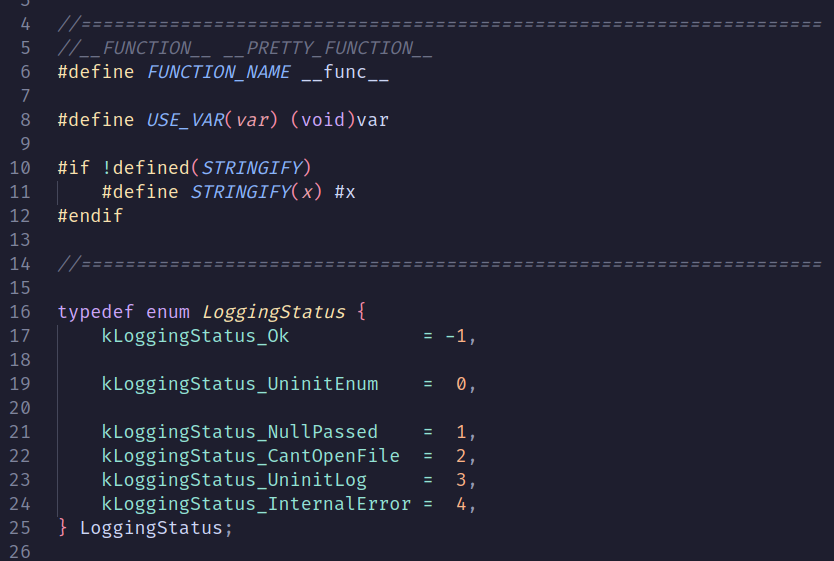
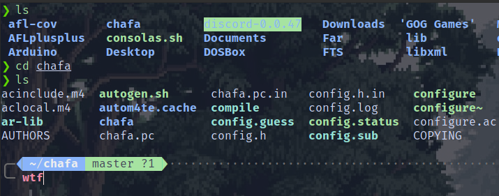
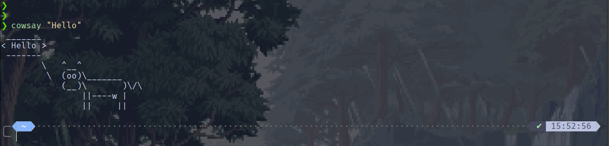
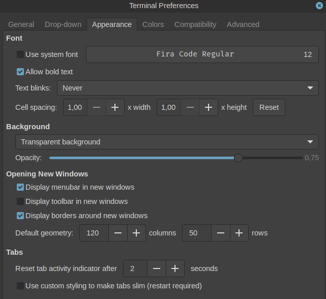
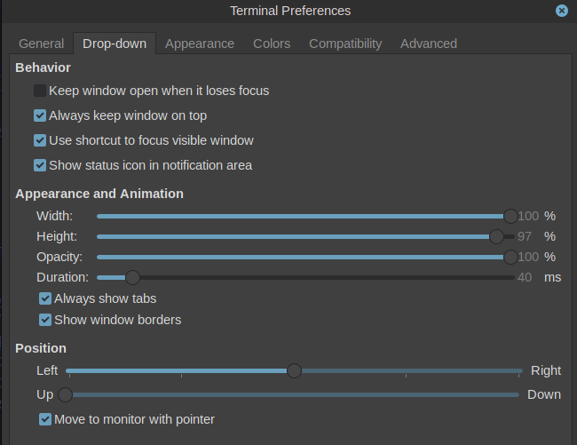
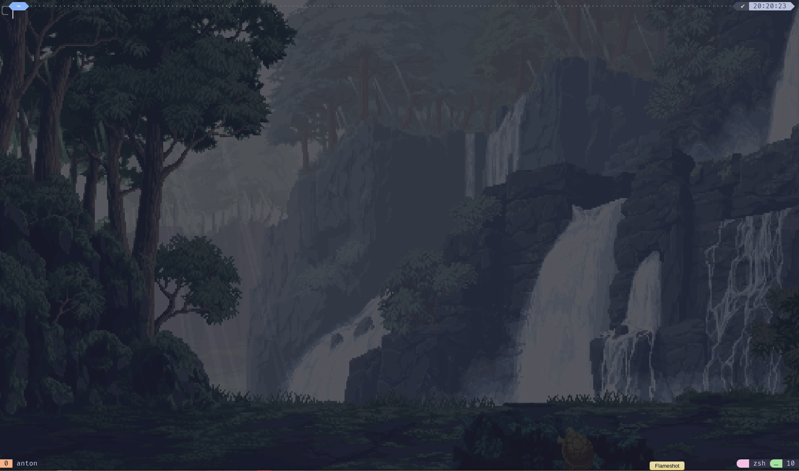

# How to make cool terminal!!!

Setup cool terminal. Next steps I did on Linux Mint(Debian).

## Color theme

Font: [Fira Code](https://github.com/tonsky/FiraCode)

I found beautiful theme [Catppuccin](https://github.com/catppuccin/) (Mocha), its plus that it has profiles for everything: xfce4-terminal, tmux, xournal, kitty, vscode and etc.





Choose and follow readme.

## Shell

Zsh and oh-my-zsh

[Base installation](https://losst.pro/nastrojka-zsh-i-oh-my-zsh)

[Pro setup](https://habr.com/ru/articles/516004/) - plugins, PowerLevel10K



## TMUX

[Tutorial](https://hamvocke.com/blog/a-quick-and-easy-guide-to-tmux)

[Guide](https://github.com/tmux/tmux/wiki/Getting-Started)

[Cool plugin](https://github.com/catppuccin/tmux)

## Terminal

### XFCE4

My default terminal was `xfce4-terminal` - its simple and cool to setup

1. [Theme](https://github.com/catppuccin/xfce4-terminal), choose one of many(my fav is Mocha)
2. Settings in terminal, to make transparent
 


1. The coolest option is `--drop-down` - you can choose shortcut and for it you will have one terminal that opens and closes. It's name is Quake terminal
    + Aim to make shortcut(on Mint: Keyboard:Shortcuts:Custom Shortcuts) with command `xfce4-terminal --drop-down`
    + Settings for drop-down



*On Mint*: everything is Ok\
*On Ubuntu*: bug with permission for xfce4 to change shortcut after loosing focus, idk why, but its still cool

*Trouble*:

Some symbols in tmux plugin is bad


> Problem in terminal

### Kitty

1. [Theme](https://github.com/catppuccin/kitty)
2. [How to configure](https://sw.kovidgoyal.net/kitty/conf/), [my quake config](kitty-quake.conf) and [my default config](kitty.conf)
3. Make quake kitty, it hasn't this feature, but i simulate it with running script!!!
    + [Post about quake kitty](https://johan.hal.se/wrote/2022/07/06/quake-kitty/) with script by changing focus(I don't like it)
    + I change this script to [quake-kitty.sh](quake-kitty.sh), that minimizes quake-window, but don't open previous(== `--drop-down`)

**My config installation:**
```bash
sudo apt-get install kitty wmctrl xdotool #to manage windows
cd ~
git clone https://github.com/khmelnitskiianton/utilsC.git
mkdir -p ~/.config/kitty/
cp utilsC/Terminal/*.conf utilsC/Terminal/kitty-quake.sh ~/.config/kitty/
sudo chmod ugo+x ~/.config/kitty/kitty-quake.sh
#> make shortcut to run this script! Write full path! 
#> like "/home/<user>/.config/kitty/kitty-quake.sh"
```

### Result

Cool kitty-quake terminal with beautiful zsh and tmux


